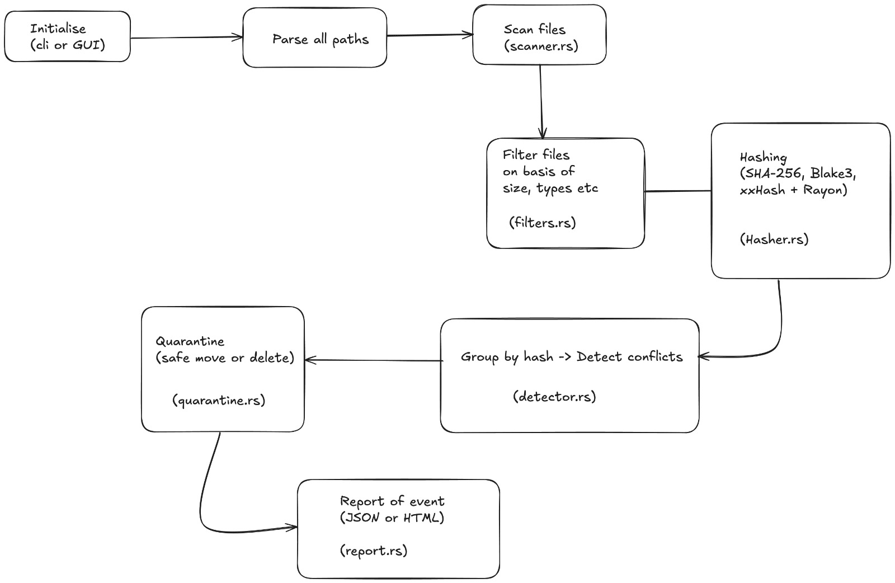

# 🦆 deduck

**deduck** is a fast, modular CLI tool to scan directories and detect duplicate files using file hashing. It supports multiple hashing algorithms, filtering, quarantining, restoration, and space cleanup reports—all from your terminal.



## 🚀 Features

- 🔍 **Scan** directories recursively
- ⚡ **Filter** files by extension & size
- 🧠 Choose **scan mode**: Quick / Normal / Deep (XxHash / Blake3 / Sha256)
- 📁 **Quarantine** duplicates safely
- 🧼 **Clean** up storage and track how much space you saved
- ♻️ **Restore** quarantined files
- 🗑️ **Purge** quarantine folder
- 📊 **Reports**: See files found, deleted, and total bytes saved

---

## 🛠️ Local Setup

### 1. Clone the Repo

```bash
git clone https://github.com/yourusername/deduck.git
cd deduck
```

### 2. Build the CLI

```bash
cargo build --release
```

The binary will be generated at:

```bash
./target/release/deduck
```

### 3. (Optional) Add to Your PATH

To run deduck globally from anywhere:

```bash
cargo install --path .
```

This installs it to:

```bash
~/.cargo/bin/deduck
```

Make sure `~/.cargo/bin` is in your PATH:

```bash
echo 'export PATH="$HOME/.cargo/bin:$PATH"' >> ~/.zshrc   # or ~/.bashrc
source ~/.zshrc                                           # or source ~/.bashrc
```
## 📦 Usage

### 🧪 Scan Directory

```bash
deduck scan --dir /path/to/folder
```

### 🧠 Filter Duplicates (and choose scan mode)

```bash
deduck filter --dir /path/to/folder
```

### ♻️ Clean Duplicates (requires filter to be run first)

```bash
deduck clean
```

### 🔄 Restore Files

```bash
deduck restore
```

### 🗑️ Purge Quarantine Folder

```bash
deduck purge
```
## 📝 Saved State

- Last scanned directory is saved in `~/.deduck/last_dir.txt`
- Last scan mode is saved in `~/.deduck/scan_mode.txt`

## 🧪 Tests

To run unit tests:

```bash
cargo test
```

## 📄 Architecture

See the architecture diagram above ☝️

## 📂 Folder Structure

deduck/
├── src/
│   ├── main.rs
│   ├── config.rs
│   ├── quarantine.rs
│   ├── hasher.rs
│   ├── filters.rs
│   ├── scanner.rs
│   ├── report.rs
│   └── commands/
│       ├── clean.rs
│       ├── filter.rs
│       ├── purge.rs
│       ├── restore.rs
│       └── scan.rs
├── tests/
│   ├── quarantine_test.rs
│   └── hasher_test.rs
└── assets/
    └── deduck_architecture.png
